# BayesFlow SBI Agent Kit

This repository provides agent guidance, templates, skills, examples, and validation tools to support principled Bayesian simulation-based inference of mechanistic simulation models using BayesFlow 2.

Note that this entire repository — and the approach behind it — is an ongoing experiment in the feasibility of developing an expert AI agent to facilitate the technical and engineering aspects of performing Bayesian inference on complex models, enabling modellers to focus on the models and research questions themselves.

The target users of this repository are domain-specific modellers (e.g. biologists, epidemiologists) without detailed knowledge of statistics or computer science. The experiment will have a positive result if such a user can interact with the agent to efficiently perform inference on their complex model and learn about the principled Bayesian workflow along the way, without abdicating any of the *scientific* process or decision-making to the agent.

If you have tried using this repository and found that the agents are not meeting this goal, please open a GitHub issue to document the failure. It is only through documenting and addressing these failure cases that this system can improve.

## Important instruction separation

This repository itself is being developed using agentic AI coding tools (GPT and Claude).  

The root `AGENTS.md` is for agents helping build this repository.

The user-facing agent instructions are stored in:

- `templates/user-repo/AGENTS.md`

Agents working on this repository should not conduct SBI unless explicitly asked to run a test, smoke test, or validation example.

## Agent skills

The reusable, user-facing guidance is packaged as **skills** in `skills/`. Each is a
`skills/<name>/SKILL.md` file that a user's SBI agent loads on demand to perform (or
help the user through) a specific part of the workflow. Current skills:

- [`workflow-orchestration`](skills/workflow-orchestration/SKILL.md) — the top-level
  map (see below).
- [`bayesflow-implementation`](skills/bayesflow-implementation/SKILL.md) — practical,
  validated engineering tips for building BayesFlow 2 workflows (constraining
  parameters, summary networks for exchangeable data, verifying inference).

### Our definition of a principled Bayesian workflow with SBI

[**`skills/workflow-orchestration/SKILL.md`**](skills/workflow-orchestration/SKILL.md)
is the canonical definition of the principled Bayesian simulation-based inference
workflow this kit promotes. It lays out the workflow as an explicit **loop, not a
line** — a failed check sends you back to an earlier stage — across ten stages:
project intake → prior review → prior predictive check → workflow design → pilot
training → parameter recovery → calibration (SBC) → posterior predictive check →
real-data inference + reliability (out-of-distribution) check → human review.

```mermaid
flowchart TD
    subgraph ActI["Act I · set up the model &amp; your beliefs"]
        S1["1 · Project intake"] --> S2["2 · Prior review 🔒"] --> S3["3 · Prior predictive check"]
    end
    subgraph ActII["Act II · prove the method works on simulated data"]
        S4["4 · Workflow design"] --> S5["5 · Pilot training"] --> S6["6 · Parameter recovery"] --> S7["7 · Calibration &#40;SBC&#41;"] --> S8["8 · Posterior predictive 🔒"]
    end
    subgraph ActIII["Act III · use it on your real data &amp; review"]
        S9["9 · Reliability / out-of-distribution check 🔒"] --> S10["10 · Human review 🔒"]
    end

    S3 --> S4
    S8 --> S9

    S3 -.->|implausible data| S2
    S7 -.->|biased / miscalibrated → retrain| S4
    S8 -.->|model misfits real data| S2
    S9 -.->|real data out-of-distribution| S2
    S10 -.->|not fit for purpose| S2
```



**🔒 = the workflow stops for your approval.** Dashed arrows are the loop: a failed
check sends you back — to *retraining* (an engineering fix) or all the way back to
*your beliefs and model* (a scientific decision, always yours to make).

It marks hard **human-approval gates** at every scientific decision and enforces the
central principle that the **agent owns the engineering while the human owns the
science**: when a check fails, the agent *diagnoses* the likely cause but never
changes the model, priors, or simulator on its own. The workflow synthesises the
published Bayesian-workflow literature (Gelman et al. 2020; Schad, Betancourt &
Vasishth 2021; the Amortized Bayesian Workflow, 2024) — see the skill's References
section.

## Intended downstream use

A user may add this repository to their own project, for example as a git submodule:

```bash
git submodule add https://github.com/YOUR-ORG/bayesflow-sbi-agent-kit.git agentic-sbi
cp agentic-sbi/templates/user-repo/AGENTS.md ./AGENTS.md
```
